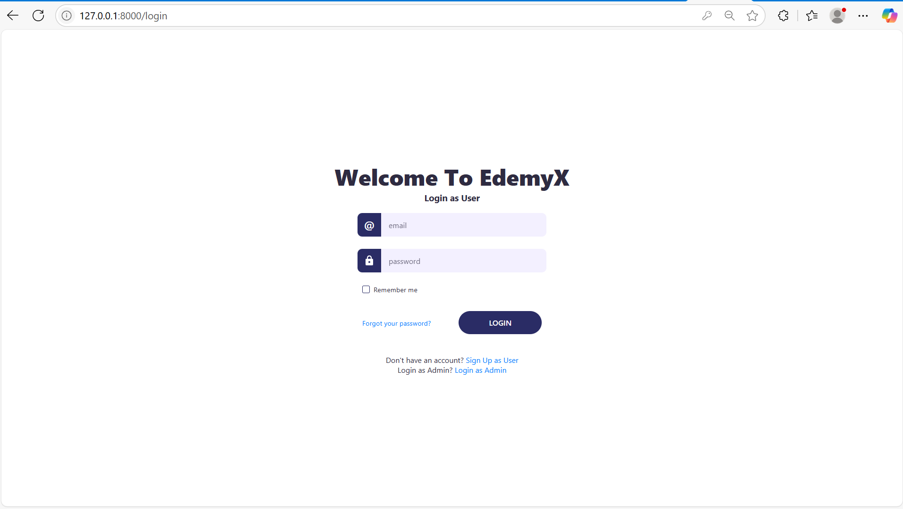
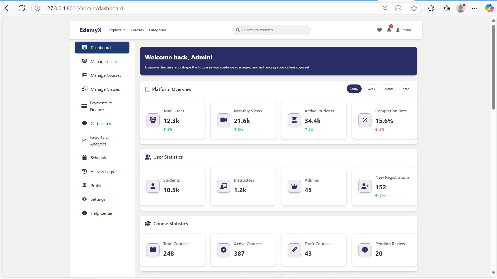
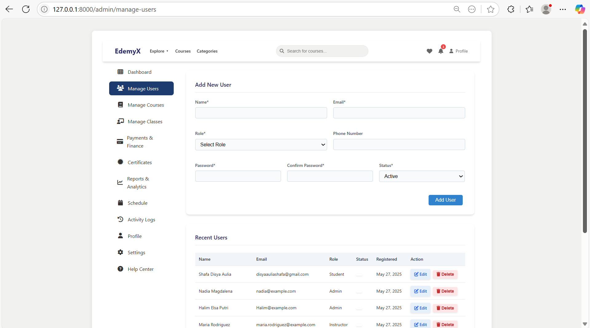
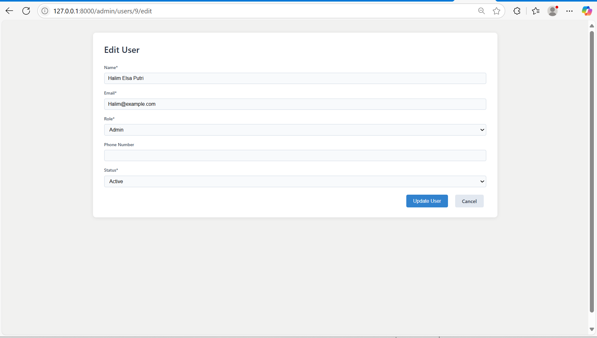
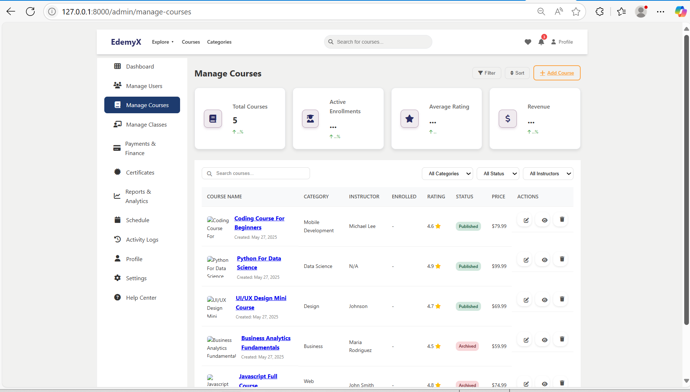
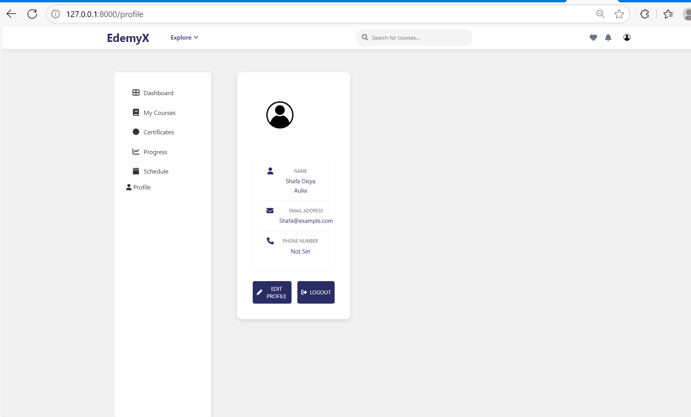

# EdemyX Laravel Project

EdemyX adalah aplikasi kursus online berbasis Laravel yang mendukung fitur multi-role (admin & user), manajemen kursus, manajemen user, dan edit profil.

---

*Kelompok 2*

Anggota : 
1. Muhammad Azani Irvand (2308107010026)
2. Halim Elsa Putra (2308107010062)
3. Shafa Disya Aulia (2308107010002)
4. Nadia Maghdalena (2308107010045)

## Fitur Utama

### 1. **Autentikasi & Login**
- User dan admin dapat login melalui halaman login masing-masing.
- Proteksi route menggunakan middleware (`auth` dan `EnsureUserIsAdmin`).

### 2. **Dashboard**
- Setelah login, user diarahkan ke dashboard sesuai role.
- Admin: `/admin/dashboard`
- User: `/dashboard`

### 3. **Manajemen User (Admin)**
- Admin dapat melihat daftar user, menambah, mengedit, dan menghapus user.
- Fitur validasi, feedback sukses/error, dan konfirmasi hapus.
- File terkait:  
  - `app/Http/Controllers/Admin/AdminUserController.php`
  - `resources/views/manage-users.blade.php`
  - `resources/views/admin/users/edit.blade.php`

### 4. **Manajemen Kursus (Admin)**
- Admin dapat melihat, menambah, mengedit, dan menghapus kursus.
- Daftar kursus diakses melalui `/admin/manage-courses`.
- File terkait:  
  - `app/Http/Controllers/Admin/AdminCourseController.php`
  - `resources/views/admin/courses/`

### 5. **Edit Profile**
- User dan admin dapat mengedit profil melalui halaman profile.
- Update data seperti nama, email, foto, dll.

### 6. **Validasi & Error Handling**
- Validasi input pada semua form.
- Pesan error dan sukses tampil di halaman terkait.
- Custom 404 page (`resources/views/errors/404.blade.php`).

---

## Struktur Route Penting

- `/login` — Login user
- `/admin/login` — Login admin
- `/dashboard` — Dashboard user
- `/admin/dashboard` — Dashboard admin
- `/admin/manage-users` — Manajemen user (admin)
- `/admin/users/{user}/edit` — Edit user (admin)
- `/admin/manage-courses` — Manajemen kursus (admin)
- `/admin/courses/{course}/edit` — Edit kursus (admin)
- `/profile` — Edit profile

---

## Cara Menjalankan

1. **Clone repository:**
   ```sh
   git clone https://github.com/username/edemyx-laravel.git
   cd edemyx-laravel
   ```

2. **Install dependency:**
   ```sh
   composer install
   npm install && npm run build
   ```

3. **Copy file environment:**
   ```sh
   cp .env.example .env
   ```

4. **Generate key:**
   ```sh
   php artisan key:generate
   ```

5. **Atur koneksi database di `.env` lalu migrate dan seed:**
   ```sh
   php artisan migrate:fresh --seed
   ```

6. **Jalankan server:**
   ```sh
   php artisan serve
   ```

7. **Akses aplikasi di browser:**  
   [http://127.0.0.1:8000](http://127.0.0.1:8000)

---

## Hasil & Tampilan

- **Login:**  
  

- **Dashboard Admin:**  
  

- **Manage Users:**  
  

- **Edit User:**  
  

- **Manage Courses:**  
  

- **Edit Profile:**  
  

---

## Penjelasan Kode

- **Controller**: Mengatur logika CRUD, validasi, dan redirect.
- **View**: Menggunakan Blade, sudah responsive dan menampilkan pesan error/sukses.
- **Route**: Menggunakan resource controller untuk CRUD, serta proteksi middleware.
- **Seeder**: Data admin/user/kursus awal otomatis diisi saat migrate:seed.

---

## Struktur Folder Utama

- `app/Http/Controllers/` — Controller aplikasi (Admin & User)
- `resources/views/` — Blade template (halaman user & admin)
- `routes/web.php` — Definisi route utama
- `public/` — Asset publik (CSS, JS, gambar, screenshot)
- `database/seeders/` — Seeder data awal

---

## Catatan Penting

- File `.env` **tidak diupload** ke repo, silakan copy dari `.env.example` dan atur sesuai database lokal Anda.
- Folder `vendor/` dan `node_modules/` juga tidak diupload (otomatis diabaikan oleh `.gitignore`).
- Untuk akses admin, gunakan akun yang sudah di-seed di database atau buat manual via seeder.

---

## Lisensi

Project ini dibuat untuk keperluan pembelajaran dan tugas kuliah. Tidak untuk dikomersialkan.


